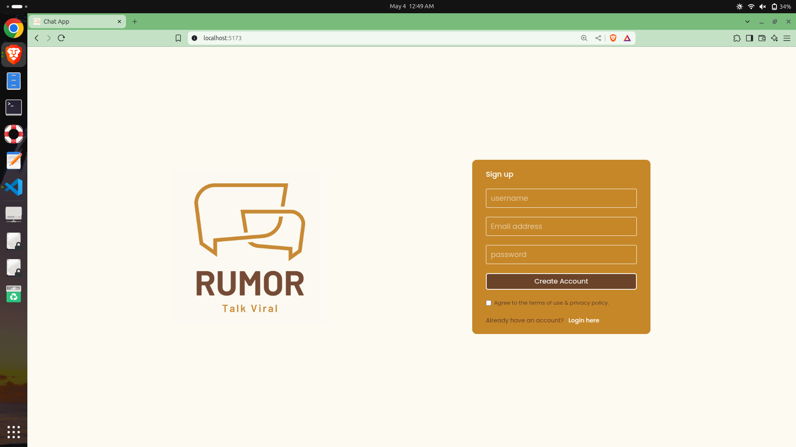

# RUMOR : chat app
A full-stack real-time chat application built with React (Vite) and Firebase. Users can create accounts, chat with friends in real-time, and share images in chat.

## Features
- User Authentication – Sign up and log in with Firebase Authentication
- Real-time Messaging – Send and receive messages instantly using Firestore
- Image Sharing – Upload and send images in chat using Firebase Storage
- Responsive UI – Clean and responsive chat interface built with React

## Tech Stack
- Frontend: React JS (Vite)
- Backend: Firebase
- Firebase Authentication
- Firestore Database
- Firebase Storage

## Getting Started
1. Prerequisites
Node.js and npm installed

2. Firebase project (set up in Firebase Console)

3. Installation
Clone the repository:
```
git clone https://github.com/inshaxkhan/rumor-chat-app
cd rumor-chat-app
```

4. Install dependencies:
```
npm install
```

5. Create a .env file and add your Firebase configuration:
env
```
VITE_API_KEY=your_api_key
VITE_AUTH_DOMAIN=your_auth_domain
VITE_PROJECT_ID=your_project_id
VITE_STORAGE_BUCKET=your_storage_bucket
VITE_MESSAGING_SENDER_ID=your_sender_id
VITE_APP_ID=your_app_id
```

6. Start the development server:
bash
```
npm run dev
```

## Screenshots



